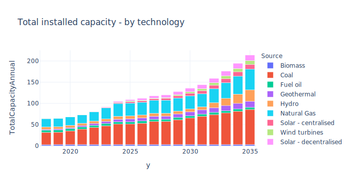

# Description of possible types of plots to use
This document describes the most commonly used plot types for visualising 
results from an OSeMOSYS model, based on the [Indonesia 
OSeMOSYS model dashboard](https://indonesia-energy-model.herokuapp.com/). For each plot type, the following aspects are
covered:
* A text description of what the plot shows
* x-axis
* y-axis
* How are the other dimensions visualised (e.g. colours)
* Data sources - which OSeMOSYS results parameters are needed
* Aggregation/processing - how is the data aggregated or transformed before 
  plotting?
  
An interactive example of some of this plots can be found in the [Indonesia 
OSeMOSYS model dashboard](https://indonesia-energy-model.herokuapp.com/).

**Contents:**
1. [Total final energy consumption (TFEC)](#total-final-energy-consumption)
1. [TFEC CO2 emissions](#tfec-co2-emissions)
1. [Electricity supply](#electricity-supply)
1. [Electricity demand](#electricity-demand)
1. [Cumulative power generation installed capacity](#cumulative-power-generation-installed-capacity)
1. [Electricity CO2 emissions](#electricity-co2-emissions)
1. [Electricity annual investment required](#electricity-annual-investment-required)
1. [Electricity annual discounted cost](#electricity-annual-discounted-cost)
1. [Renewable energy share](#renewable-energy-share)
  
## Total final energy consumption
This plot shows the annual value of **total final energy consumption** including 
all type of fuels. It can be displayed as a line plot disaggregating the 
information by scenario, or as a stacked bar plot for a specific scenario, 
using final energy users (i.e. sectors) or energy source (e.g. 
electricity, oil, diesel, natural gas) as stack variable.

### X-axis data
Years in ascending order (column `y`).
### Y-axis data
TFEC values expressed in a standard energy unit as PJ 
(column `UseByTechnologyAnnual`).
### Colors
Colors are used to disaggregate scenarios, sectors of energy use or energy 
sources. Line patterns, point shapes or bar fill patterns may also be used to 
provide more information as subscenarios. The columns `scenario`, `t`, `f` and 
`Sector` can be used for this purpose (see **table 1** and **table 2**).
### Data sources
The `UseByTechnologyAnnual.csv` file is used (see **table 1**) for these plots in 
combination with a custom excel file (see **table 2**) that provide information 
about the technologies that should be considered and the sectors each technology 
belongs to (this is important as no all technologies should be displayed). 
The `.csv` files for each scenario are added together and an extra column is 
created to indicate the scenario. **Table 2** is merged by technology name 
`t` with the `UseByTechnologyAnnual.csv` results. The resulting dataframe is 
grouped by year `y` and `scenario` or `y` and `Sector` and the 
`UseByTechnologyAnnual` summed up. The final dataframe is used in a long format 
to create the plot.

**Table 1.** ``UseByTechnologyAnnual.csv`` file sample.

| |r|t|f|y|UseByTechnologyAnnual|scenario
|---|:---|---|---|---|---|---
0|Region1|BIO_RESPRD|BIO|2018|0.0|BAU
1|Region1|BIO_RESPRD|BIO|2019|0.0|BAU
2|Region1|BIO_RESPRD|BIO|2020|0.0|BAU
3|Region1|BIO_RESPRD|BIO|2021|0.0|BAU
4|Region1|BIO_RESPRD|BIO|2022|0.0|BAU

**Table 2.** Total final energy consumption complementary excel file sample.

t|Sector|Use|Fuel
---|---|---|---
RES_COOL_001|Residential|Cooling|Electricity
RES_COOL_002|Residential|Cooling new users|Electricity
RES_CWH_EL_001|Residential|Cooking and water heating|Electricity
RES_EL_APP_001|Residential|Electrical appliances|Electricity
RES_EL_APP_002|Residential|Electrical appliances new users|Electricity
RES_CWH_BIO_001|Residential|Cooking and water heating|Biomass
RES_CWH_KER_001|Residential|Cooking and water heating|Kerosene
RES_CWH_SOLAR|Residential|Water heating mainly|Solar
RES_CWH_NGS_001|Residential|Cooking and water heating|Natural Gas
RES_CWH_LPG_001|Residential|Cooking and water heating|LPG
COM_EL_APP_001|Commercial|Electricity appliances|Electricity
COM_CWH_BIO_001|Commercial|Other uses|Biomass
COM_CWH_NGS_001|Commercial|Other uses|Natural Gas

The excel file could probably be omitted if naming conventions are used and a 
mapping function is implemented to translate such names (from columns ``t`` and ``f``) 
into a more user friendly output and select the relevant technologies to display. 
However, to have an user defined excel file will allow for the user to have full
control about the names.

## TFEC CO2 emissions
This plot shows the value of **CO2 emissions**. It can be displayed as an annual 
emissions line plot disaggregating the information by scenario, as a total 
emissions bar plot per scenario, or as a stacked bar of emissions per fuel 
source for a specific scenario.

### X-axis data
Years in ascending order (column `y`).
### Y-axis data
Total CO2 emissions values expressed in Mton (column `AnnualTechnologyEmission`).
### Colors
Colors are used to disaggregate scenarios or stack emissions values of 
different fuel sources. The columns `scenario` or `t` can be used for this 
purpose (see **table 3**).
### Data sources
The `AnnualTechnologyEmission.csv` file is used (see **table 3**) for these plots.
These `.csv` files for each scenario are added together and an extra column is 
created to indicate the scenario. The resulting dataframe is 
grouped by year `y` and `scenario` or `y` and technology `t` and the 
`AnnualTechnologyEmission` summed up. The final dataframe is used in a long format 
to create the plot.

**Table 3.** ``AnnualTechnologyEmission.csv`` file sample.

| |r|t|e|y|AnnualTechnologyEmission|scenario
|---|---|---|---|---|---|---
0|Region1|BIO_RESPRD|CH4|2018|0.0|BAU
1|Region1|BIO_RESPRD|CH4|2019|0.0|BAU
2|Region1|BIO_RESPRD|CH4|2020|0.0|BAU
3|Region1|BIO_RESPRD|CH4|2021|0.0|BAU
4|Region1|BIO_RESPRD|CH4|2022|0.0|BAU

The bar graph version of this plot, would require a function to translate the 
standard names used in `t`, to an user friendly format. Moreover, if different 
emission gasses are reported, then the column `e` could also be used for the 
color attribute.

## Electricity supply
This plot shows the annual value of **total electricity generation**. It can be 
displayed as a line plot disaggregating the information by scenario, or as a 
stacked bar plot for a specific scenario, using energy sources as stack variable.

### X-axis data
Years in ascending order (column `y`).
### Y-axis data
Total electricity generation values expressed in PJ (column `ProductionByTechnologyAnnual`).
### Colors
Colors are used to disaggregate scenarios or stack generation values of 
different energy sources. The columns `scenario` and `Source` can be used for this 
purpose (see **table 4**).
### Data sources
The `ProductionByTechnologyAnnual.csv` file is used (see **table 4**) for these 
plots in combination with a custom excel file (see **table 5**) that provides 
information about the technologies that should be considered and the energy sources
each technology belongs to. The `.csv` files for each scenario are added together 
and an extra column is created to indicate the scenario. **Table 5** is merged 
by technology name `t` with the combined `ProductionByTechnologyAnnual.csv` 
results for all scenarios. The resulting dataframe is 
grouped by year `y` and `scenario` or `y` and `Source` and the 
`ProductionByTechnologyAnnual` summed up. The final dataframe is used in a long format 
to create the plot.

**Table 4.** `ProductionByTechnologyAnnual.csv` file sample.

| |r|t|f|y|ProductionByTechnologyAnnual|scenario
---|---|---|---|---|---|---
0|Region1|BIO_RESPRD|BIO|2018|0.0|BAU
1|Region1|BIO_RESPRD|BIO|2019|0.0|BAU
2|Region1|BIO_RESPRD|BIO|2020|0.0|BAU
3|Region1|BIO_RESPRD|BIO|2021|0.0|BAU
4|Region1|BIO_RESPRD|BIO|2022|0.0|BAU

**Table 5.** Energy generation complementary excel file sample.

t|Use|Source|Type|EmissionActivityRatio
---|---|---|---|---
PWR_COA_001|Centralised electricity supply|Coal|Fossil fuel|0.0961
PWR_NGS_001|Centralised electricity supply|Natural Gas|Fossil fuel|0.0561
PWR_OILPRD_001|Centralised electricity supply|Fuel oil|Fossil fuel|0.0741
PWR_BIO_001|Centralised electricity supply|Biomass|Renewable|0.1225

The excel file could probably be omitted if naming conventions are used and a 
mapping function is implemented to translate such names (from columns ``t`` and ``f``) 
into a more user friendly output and select the relevant technologies to display.

## Electricity demand
This plot shows the annual value of **total electricity demand**. It can be 
displayed as a line plot disaggregating the information by scenario, or as a 
stacked bar plot for a specific scenario, using final energy users 
(i.e. sectors) as stack variable.

### X-axis data
Years in ascending order (column `y`).
### Y-axis data
Total electricity demand values expressed in PJ (column `UseByTechnologyAnnual`).
### Colors
Colors are used to disaggregate scenarios or stack demand values of 
different demand sectors. The columns `scenario` or `Sector` can be used for this 
purpose (see **table 1** and **table 6**).
### Data sources
The `UseByTechnologyAnnual.csv` file is used (see **table 1**) for these 
plots in combination with a custom excel file (see **table 6**) that provides 
information about the technologies that should be considered and the demand 
sectors. The `.csv` files for each scenario are added together and an extra 
column is created to indicate the scenario. **Table 6** is merged by technology 
name `t` with the combined `UseByTechnologyAnnual.csv` results for all scenarios. 
The resulting dataframe is 
grouped by year `y` and `scenario` or `y` and `Sector` and the 
`UseByTechnologyAnnual` summed up. The final dataframe is used in a long format 
to create the plot.

**Table 6.** Energy demand complementary excel file sample.

| |t|Sector|Use|Fuel
|---|---|---|---|---|
0|RES_COOL_001|Residential|Cooling|Electricity
1|RES_COOL_002|Residential|Cooling new users|Electricity
2|RES_CWH_EL_001|Residential|Cooking and water heating|Electricity
3|RES_EL_APP_001|Residential|Residential appliances|Electricity
4|RES_EL_APP_002|Residential|Residential appliances new users|Electricity
5|COM_EL_APP_001|Commercial|Commercial uses|Electricity
6|TRA_BUS_ELC_001|Transport|Buses|Electricity

The excel file could probably be omitted if naming conventions are used and a 
mapping function is implemented to translate such names (from columns ``t``) 
into a more user friendly output and select the relevant technologies to display.

## Total installed capacity
This plot shows the **total installed capacity** per power generation technology
for one scenario at a time.

### X-axis data
Years in ascending order (column `y`).
### Y-axis data
Total installed capacity expressed in GW (column `TotalCapacityAnnual`).
### Colors
Colors are used to stack total installed capacity of each technology. The 
column `Source` is used for this purpose (see **table 5**).
### Data sources
The `TotalCapacityAnnual.csv` file is used (see **table 7**) for these 
plots in combination with a custom excel file (see **table 5**) that provides 
information about the technologies that should be considered and the power
generation sources. The `.csv` files for each scenario are added together and an extra 
column is created to indicate the scenario. **Table 5** is merged by technology 
name `t` with the combined `TotalCapacityAnnual.csv` results for all scenarios. 
The resulting dataframe is 
grouped by year `y` and `Source` and the 
`TotalCapacityAnnual` summed up. The final dataframe is used in a long format 
to create the plot.

**Table 7.** `TotalCapacityAnnual.csv` file sample.

| |r|t|y|TotalCapacityAnnual|scenario
|---|---|---|---|---|---
0|Region1|BIO_RESPRD|2018|298.866133|BAU
1|Region1|BIO_RESPRD|2019|313.137201|BAU
2|Region1|BIO_RESPRD|2020|328.089721|BAU
3|Region1|BIO_RESPRD|2021|343.756236|BAU
4|Region1|BIO_RESPRD|2022|360.170837|BAU

The excel file could probably be omitted if naming conventions are used and a 
mapping function is implemented to translate such names (from columns ``t``) 
into user friendly technology types and select the relevant technologies to 
display.

## Electricity CO2 emissions
This plot shows the value of **CO2 emissions** from electricity generation.
It can be displayed as an annual emissions line plot disaggregating the 
information by scenario, or as a total emissions bar plot per scenario, or as a 
stacked bar of emissions per fuel source for a specific scenario.

### X-axis data
Years in ascending order (column `y`).
### Y-axis data
Total CO2 emissions values expressed in Mton (column `UseByTechnologyAnnual` * 
`EmissionActivityRatio`).
### Colors
Colors are used to disaggregate scenarios or stack emissions values of 
different fuel sources. The columns `scenario` or `f` can be used for this 
purpose (see **table 3**).
### Data sources
The `UseByTechnologyAnnual.csv` file is used (see **table 1**) and the 
`EmissionActivityRatio`. These `.csv` files for each scenario are added together
and an extra column is created to indicate the scenario. A complementary excel
file is used (see **table 5**) in which the relevant power generation 
technologies to display are indicated. This table is merged by technology name 
`t` with the OSeMoSYS results. The resulting dataframe is 
grouped by year `y` and `scenario` or `y` and `Source` and the  
`Emisions` (from the `UseByTechnologyAnnual` * 
`EmissionActivityRatio` calculation) summed up. The final dataframe is used in a long format 
to create the plot.

The excel file could probably be omitted if naming conventions are used and a 
mapping function is implemented to translate such names (from columns ``t`` and ``f``) 
into a more user friendly output and select the relevant technologies to display. 

## Investment in new generation capacity
This plot shows the **capital investment** for new electricity generation 
capacity. It can be displayed as an annual investment line plot disaggregating 
the information by scenario, as a total costs bar plot per scenario, or as a 
stacked bar of annual investments per technology for a specific scenario.

### X-axis data
Years in ascending order (column `y`).
### Y-axis data
Total investment expressed in M$ (column `CapitalInvestment`).
### Colors
Colors are used to disaggregate scenarios or stack emissions values of 
different technologies. The columns `scenario` or `Source` can be used for this 
purpose (see **table 8** and **table 5**).
### Data sources
The `CapitalInvestment.csv` file is used (see **table 8**). These `.csv` files 
for each scenario are added together and an extra column is created to indicate 
the scenario. A complementary excel file is used (see **table 5**) in which the 
relevant power generation technologies to display are indicated. This table is 
merged by technology name `t` with the OSeMoSYS results. The resulting dataframe is 
grouped by year `y` and `scenario` or `y` and `Source` and the 
`CapitalInvestment` summed up. The final dataframe is used in a long format 
to create the plot.

**Table 8.** `CapitalInvestment.csv` file sample.

| |r|t|y|CapitalInvestment|scenario
|---|---|---|---|---|---
0|Region1|BIO_RESPRD|2018|0.029887|BAU
1|Region1|BIO_RESPRD|2019|0.031314|BAU
2|Region1|BIO_RESPRD|2020|0.032809|BAU
3|Region1|BIO_RESPRD|2021|0.034376|BAU
4|Region1|BIO_RESPRD|2022|0.036017|BAU

The excel file could probably be omitted if naming conventions are used and a 
mapping function is implemented to translate such names (from columns ``t``) 
into user friendly technology types and select the relevant technologies to 
display.

## Electricity annual discounted cost
This plot shows the **total discounted cost**. It can be displayed as an annual
discounted costs line plot disaggregating the information by scenario, or as a 
total costs bar plot per scenario.

### X-axis data
Years in ascending order (column `y`).
### Y-axis data
Total investment expressed in M$ (column `TotalDiscountedCost`).
### Colors
Colors are used to disaggregate scenarios. The column `scenario` is used.
### Data sources
The `TotalDiscountedCost.csv` file is used (see **table 9**). These `.csv` files 
for each scenario are added together and an extra column is created to indicate 
the scenario. The resulting dataframe is 
grouped by year `y` and `scenario` and the 
`TotalDiscountedCost` summed up. The final dataframe is used in a long format 
to create the plot.

**Table 9.** `TotalDiscountedCost.csv` file sample.

| |r|y|TotalDiscountedCost|scenario
|---|---|---|---|---
0|Region1|2018|83512.552122|BAU
1|Region1|2019|80671.629752|BAU
2|Region1|2020|80369.940058|BAU
3|Region1|2021|80579.205662|BAU
4|Region1|2022|78726.087087|BAU

## Renewable energy share
This plot shows the annual **RE share** in electricity generation. It can be 
displayed as an area plot for a single scenario, or as afacet plot for all 
scenarios. The fossil fuel and renewable energy sources are disaggregated by 
olors.

### X-axis data
Years in ascending order (column `y`).
### Y-axis data
Percentage of energy generated by each energy type.
### Colors
Colors are used to disaggregate energy types (i.e. fossil or renewable). 
The column `scenario` is used to facet the results per scenario.
### Data sources
The `ProductionByTechnologyAnnual.csv` file is used (see **table 4**) in 
combination with the energy generation excel file (see **table 5**). These 
`.csv` files for each scenario are added together and an extra column is created 
to indicate the scenario. Then they are merged with the excel file on technology 
``t``. Moreover, the dataframe is grouped by `scenario`, year `y` and energy 
`Type`, and the `ProductionByTechnologyAnnual` values are summed up. Then, the 
generation shares per scenario, per year and per energy type, are calculated by 
dividing the `ProductionByTechnologyAnnual` per `scenario`, year `y` and energy 
`Type` by the sum of `ProductionByTechnologyAnnual` per `scenario` and year `y`.
The dataframe is then used in a long format to create the plot.